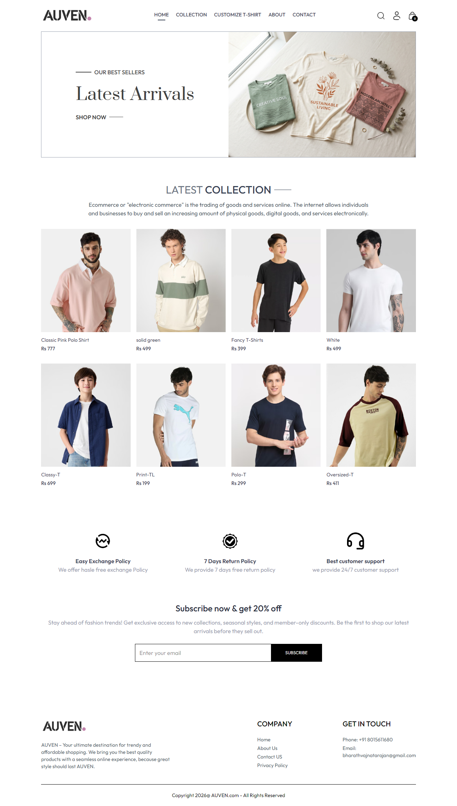
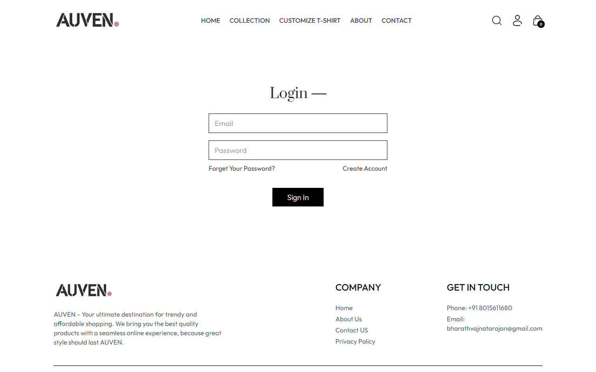
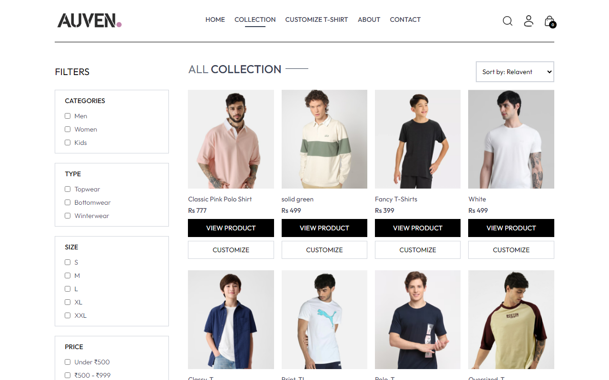
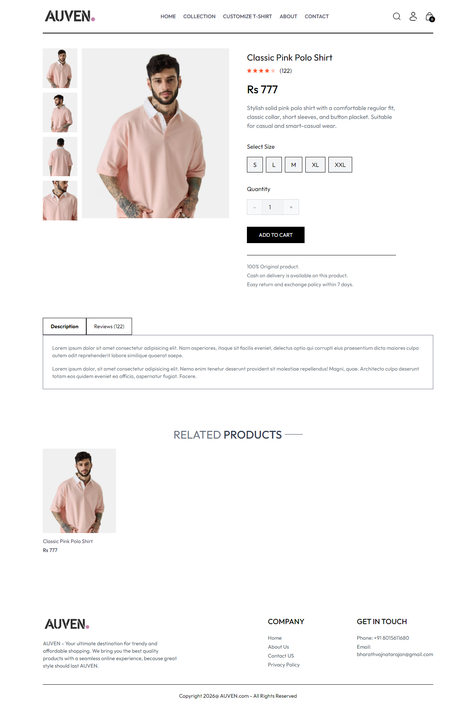
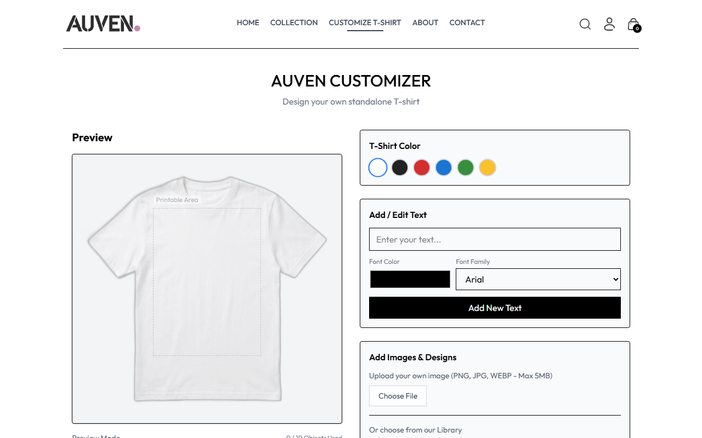
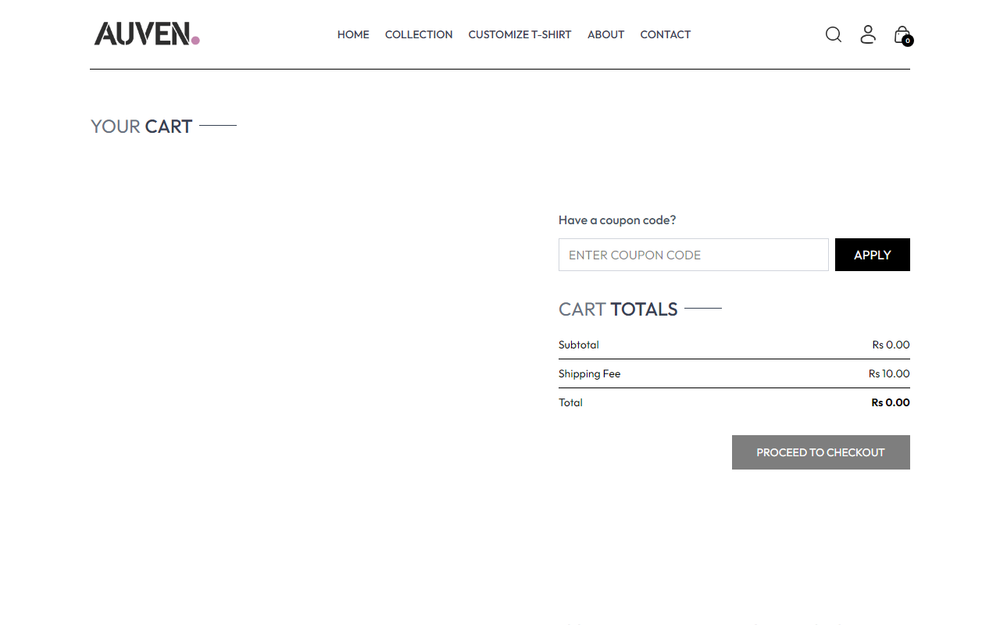
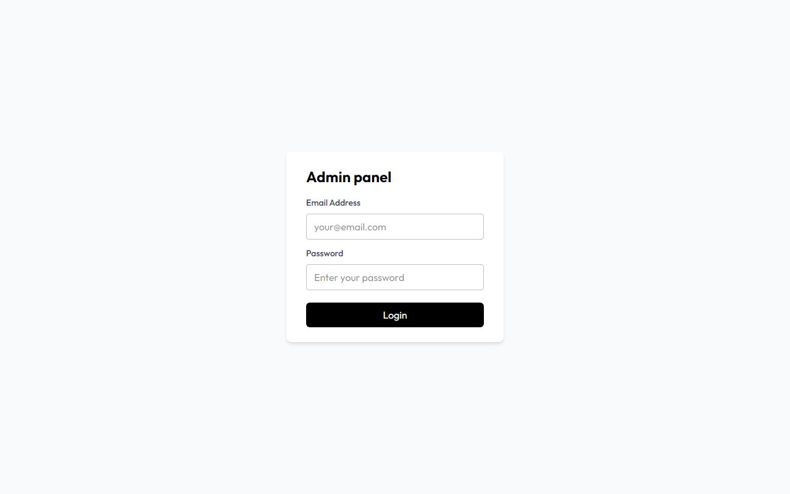
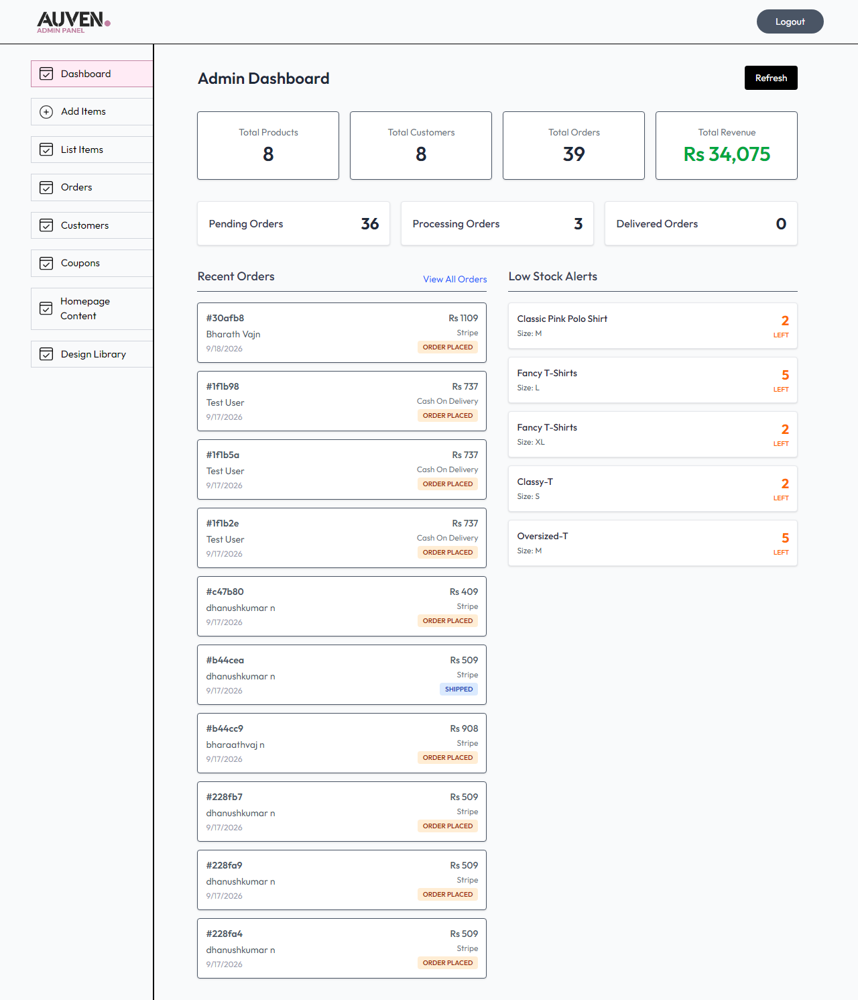
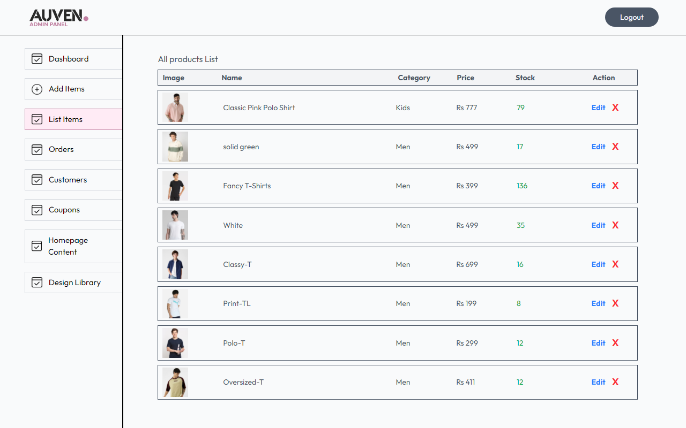
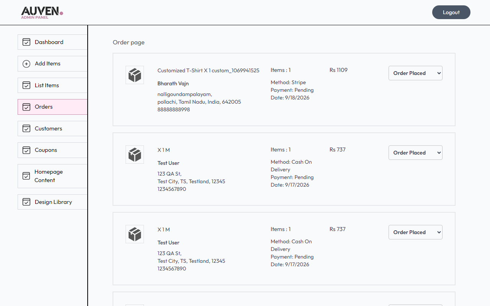

# AUVEN FASHION
## USER DOCUMENTATION
### User Manual for Customised T-Shirt E-commerce Platform

---

## Table of Contents
1. [Getting Started](#getting-started)
2. [Home Page](#home-page)
3. [User Registration & Login](#user-registration--login)
4. [Browse & Search Products](#browse--search-products)
5. [Product Details](#product-details)
6. [T-Shirt Customizer User Guide](#t-shirt-customizer-user-guide)
7. [Cart](#cart)
8. [Checkout & Payment](#checkout--payment)
9. [Order Management & User Profile](#order-management--user-profile)
10. [AUVEN Admin Panel User Guide](#auven-admin-panel-user-guide)
11. [Troubleshooting](#troubleshooting)
12. [FAQ](#faq)
13. [User Workflow](#user-workflow)
14. [User Feature Implementation Status](#user-feature-implementation-status)

---

## 1. Getting Started
Welcome to the AUVEN Fashion e-commerce platform! AUVEN Fashion is a comprehensive customized T-shirt clothing brand that allows users to seamlessly browse, customize, and purchase high-quality clothing.

The platform provides a simple way to find your favorite designs or upload your own creative artwork to print on T-shirts. Whether you're purchasing ready-made designs or fully customized apparel, AUVEN makes the experience fluid across desktop, tablet, and mobile devices.

---

## 2. Home Page
The Home Page is your starting point for discovering products. 


<br>
<em>Figure 1: AUVEN Fashion Homepage</em>

**Key Elements:**
- **Navigation Bar:** Allows you to quickly jump to Collections, About, Contact, or track your orders. It also contains icons for Search, User Profile/Login, and the Cart.
- **Featured / Latest Collections:** Browse the newest arrivals immediately upon landing.
- **Best Sellers:** See the most popular T-shirts currently purchased by the community.

---

## 3. User Registration & Login


<br>
<em>Figure 2: User Login and Registration</em>

### User Registration
1. Click the **Profile icon** on the top right navigation bar.
2. If you don't have an account, click **Sign Up** on the authentication page.
3. Enter your **Name**, **Email**, and **Password**.
4. Click **Sign Up** to submit your details. Upon success, you will automatically be logged in and can access your profile and order history.

### User Login
1. Click the **Profile icon** on the top navigation bar.
2. Ensure you are on the **Login** tab.
3. Enter your registered **Email** and **Password**.
4. Click **Login**. Once successful, you can proceed to checkout, track your orders, and manage your account.

---

## 4. Browse & Search Products


<br>
<em>Figure 3: Product Collection and Filters</em>

### Browse Products
Navigate to the **Collection** page from the top menu to view the full catalog. Each product card displays the product's image, name, and current price.

### Search Products
Click the **Search (Magnifying Glass) icon** in the top navigation bar. A search field will appear. Type the name of the product you are looking for, and the collection will instantly filter to show matching results.

### Filter Products
On the left side of the **Collection** page, you can use filters to narrow down your choices:
- **Category:** Filter by Men, Women, or Kids.
- **Subcategory:** Filter by Topwear, Bottomwear, or Winterwear.
- **Sort By:** Sort the results by relevance, price (low to high), or price (high to low).

---

## 5. Product Details


<br>
<em>Figure 4: Product Details Page</em>

Clicking on any product card takes you to the **Product Details** page. Here you can:
- View multiple high-resolution images of the product.
- Read a detailed description.
- Select your preferred **Size** (e.g., S, M, L, XL).
- View the price.
- Add the product directly to your cart if no customization is needed.
- If the T-shirt supports customization, click the **Customize** button to open the Design Studio.

---

## 6. T-Shirt Customizer User Guide


<br>
<em>Figure 5: T-Shirt Customizer</em>

The core feature of AUVEN Fashion is the ability to create your own customized apparel.

1. **Open the Customizer:** From the product page or directly via the customizer link.
2. **Select Color & Size:** Choose the base color of your T-shirt (e.g., Black, White) and your preferred size.
3. **Add Text:** 
   - Click "Add Text" to insert custom text onto the shirt.
   - You can drag the text to move it around.
   - Use the resizing handles to scale the text up or down.
4. **Upload Custom Design/Image:**
   - Click "Upload Image" to add your own logo or artwork.
   - Once uploaded, it appears on the canvas.
   - You can click and drag the image to reposition it within the printable area (the designated rectangle on the shirt).
   - Use the corners of the image box to resize the design.
5. **Delete Elements:** Select any text or image and click the "Delete" or trash icon to remove it.
6. **Printable Area:** All designs must stay within the highlighted box on the T-shirt mockup. Elements placed outside this box may not be printed correctly.
7. **Add to Cart:** Once you are satisfied with your preview, click the "Add to Cart" button to save your customized design and proceed to checkout.

---

## 7. Cart


<br>
<em>Figure 6: Shopping Cart</em>

The Cart page displays all the items you intend to purchase, including customized products.
- **Viewing Products:** Review product images, names, selected sizes, and base prices.
- **Quantity Adjustments:** Increase or decrease the quantity of each item using the number inputs.
- **Removing Products:** Click the trash icon next to an item to remove it from your cart.
- **Cart Total:** The system automatically calculates your subtotal, shipping fee, and total amount.
- **Proceed to Checkout:** Once ready, click "Proceed to Checkout" to move to the payment stage.

---

## 8. Checkout & Payment

### Checkout Process
1. From the Cart, click **Proceed to Checkout**.
2. **Delivery Information:** Fill in your contact details including First Name, Last Name, Email, Street, City, State, Zipcode (Pincode), Country, and Phone Number.
3. The system will validate that all required fields are filled before allowing you to proceed.

### Payment Methods
AUVEN Fashion supports multiple payment avenues (Stripe, Razorpay, or Cash on Delivery where applicable).
1. Select your preferred payment method on the right side of the screen.
2. Click **Place Order**.
3. If using an online payment gateway (like Stripe), you will securely enter your card details.
4. Upon successful payment, you will be redirected to the **Order Confirmation** page. 

*(Note: Payment processing is completely secure. Your card details are never stored on AUVEN servers, but are handled directly by the payment provider).*

---

## 9. Order Management & User Profile

### Order History
To track your purchases:
1. Log into your account.
2. Click the Profile icon and select **Orders**.
3. You will see a list of all past and current orders, including the items purchased, total amount paid, and the **Order Status** (e.g., Order Placed, Packing, Shipped, Delivered).
4. Click "Track Order" to refresh the latest status of your delivery.

---

## 10. AUVEN Admin Panel User Guide


<br>
<em>Figure 7: Admin Login</em>


<br>
<em>Figure 8: Admin Dashboard</em>

The Admin Panel is a dedicated portal for store managers to handle inventory and orders.

### Admin Login
Navigate to the admin URL and enter the administrator email and password.

### Product Management

<br>
<em>Figure 9: Admin Products List</em>
- **View Products:** Click "List Items" to see all current inventory.
- **Add Product:** Click "Add Items" to create a new product. You can upload up to 4 images, set the name, description, category, subcategory, price, and available sizes. You can also toggle if a product is a "Bestseller".
- **Delete Product:** Remove items from the list view using the 'X' button.

### Order Management

<br>
<em>Figure 10: Admin Orders</em>
- Click "Orders" to view all customer purchases.
- You can view customer delivery details and the items they purchased.
- **Update Status:** Use the dropdown menu next to an order to update its status (Order Placed -> Packing -> Shipped -> Out for delivery -> Delivered).

*(Note: Other admin features like Design Library or Coupons can be managed if enabled in the side navigation menu).*

---

## 11. Troubleshooting

- **Cannot Login:** Ensure you are using the correct email and password. If you just registered, ensure the process completed successfully.
- **Product Image Not Loading:** Check your internet connection or try refreshing the page.
- **Customizer Not Working/Cannot Upload Design:** Ensure your image is in a supported format (JPG/PNG) and is not excessively large.
- **Cannot Add to Cart:** Make sure you have selected a valid "Size" before clicking "Add to Cart".
- **Checkout Validation Error:** Ensure all required fields (like Pincode and Phone Number) are filled out in the delivery form.
- **Payment Failure:** If your payment is declined, try another payment method or contact your bank. The order will not be placed until payment is successful.

---

## 12. FAQ

**Q: How do I create an account?**
A: Click the Profile icon at the top right, select 'Sign Up', and fill in your details.

**Q: How do I customize a T-shirt?**
A: Navigate to a customizable product, click 'Customize', select your color and size, and use the tools to add text or upload an image.

**Q: Can I upload my own design?**
A: Yes. In the Customizer, use the "Upload Image" button to upload your logo or artwork. You can then resize and position it.

**Q: How do I resize my design?**
A: Click on the uploaded image or text in the customizer, and drag the corner handles to resize.

**Q: Where can I see my orders?**
A: Log into your account and navigate to the 'Orders' page via the profile dropdown menu.

**Q: How does the admin manage products?**
A: The admin logs into the Admin Panel and uses the "Add Items" and "List Items" sections to manage the product catalog.

---

## 13. User Workflow

```
REGISTER / LOGIN
       ↓
BROWSE PRODUCTS
       ↓
SELECT T-SHIRT
       ↓
CUSTOMIZE (Add text/images)
       ↓
PREVIEW
       ↓
SELECT SIZE & COLOUR
       ↓
ADD TO CART
       ↓
CHECKOUT (Enter Address)
       ↓
PAYMENT
       ↓
ORDER CONFIRMATION
       ↓
ORDER HISTORY / TRACKING
```

---

## 14. User Feature Implementation Status

| PRD Feature | Available in Application | Notes |
|-------------|---------------------------|-------|
| User registration and login | Implemented | Available via Profile icon |
| Browse and search T-shirts | Implemented | Search bar in navigation |
| Filter by category, size, colour, price | Partially Implemented | Filter by Category/Subcategory present. Price/Colour filters are limited or absent in UI. |
| View product details | Implemented | Includes size selection and description |
| Customise T-shirts (text/images) | Implemented | Customizer tool exists |
| Position, resize, preview designs | Implemented | Drag and scale functionality in customizer |
| Add customised T-shirts to cart | Implemented | Seamlessly integrated |
| Manage cart and quantity | Implemented | Users can increase/decrease/remove items |
| Checkout with delivery address | Implemented | Full address form with validation |
| Online payment | Implemented | Stripe & Razorpay integrations |
| Order confirmation & history | Implemented | Orders page available |
| Track order status | Implemented | Status updates from Admin panel |
| Manage profile and addresses | Partially Implemented | Orders viewable, but full address book management is limited |
| Admin login & Dashboard | Implemented | Admin authentication and summary page |
| Product management | Implemented | Full CRUD for products |
| Category/size/pricing management | Implemented | Handled during product creation |
| Inventory management | Partially Implemented | Basic stock tracking during creation |
| Design library | Partially Implemented | UI exists but specific predefined designs may be limited |
| Customer management | Implemented | Can view customers in Admin |
| Order management | Implemented | Status updates fully functional |
| Coupons/discounts | Implemented | Admin panel section for Coupons exists |
| Homepage banners/content | Implemented | Admin panel section for Homepage Content exists |

---
*Generated by AUVEN Documentation System*
